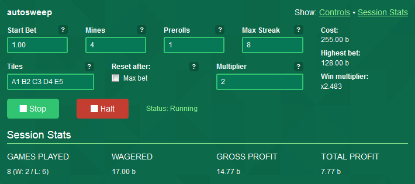

# autosweep - diggit-bot v0.0.7

Automatic betting for https://diggit.io - by jet (#1761 on diggit)

### Installation

#### Firefox

- Install the [Greasemonkey](https://addons.mozilla.org/en-US/firefox/addon/greasemonkey/) addon. *(requires a restart)*
- Click this: [+install](https://github.com/jetbtc/diggit-bot/raw/master/diggit-bot.user.js)
- Click `Install` in the Greasemonkey popup
- Refresh diggit

#### Chrome

Chrome support is **not** official. New versions are not being tested in Chrome before being released. Since Firefox and Chrome are *(about)* equally good with Javascript and none of the Greasemonkey/Tampermonkey features are being used, there should not be any problems.

- Install the [Tampermonkey](https://chrome.google.com/webstore/detail/tampermonkey/dhdgffkkebhmkfjojejmpbldmpobfkfo) addon.
- Click this: [+install](https://github.com/jetbtc/diggit-bot/raw/master/diggit-bot.user.js)
- Click `Install` in the Tampermonkey popup
- Refresh diggit

#### Internet Explorer / Opera / Others

- Get a proper browser
- See the Firefox or Chrome instructions

### Updating

- Click this: [+update](https://github.com/jetbtc/diggit-bot/raw/master/diggit-bot.user.js)
- Refresh diggit
- No more steps. Enjoy!

### Features

The bot was developed for **simple strategies based on the martingale system**, so the UI doesn't let you do much more than variations of that **as of now**. If there is demand for new features, I might add them.

**Note:** By default, the bot does not make bets bigger than 0.005BTC/5000 bits. See special features.

**IMPORTANT [8 Jun '15]:** If you set the "Tiles" field to a number to make the bot randomly click tiles, those will be chosen at the **beginning of every streak**, not at the beginning of every individual game! How to play martingale-variations on minesweeper is not exactly well-defined, but it seemed to make more sense to pick a set of tiles and go through with that choice until a streak is finished, instead of choosing new tiles on every game. That would feel like the equivalent of playing martingale on dice-sites while randomly switching between HI and LO.

That design on this specific feature has been questioned quite a bit and has, without a doubt, generated the most feedback on the bot so far. Expect changes.

**FEEDBACK IS VERY WELCOME.** If you have any questions or thoughts on this or anything else related to the bot, please contact me. (See the bottom of this README)

Thank you.

#### Features so far:

- Prerolls
- Max Streak
- Choose the tiles to click or let the bot click random ones
- Display of the potential cost of your current settings
- Session stats (reset on page refresh)
- The bot adheres to the currency (BTC/bits) you selected on the site

#### Special features:

To keep things a little interesting, I added a maximum bet for the default version of the bot. Most people using it will probably not be affected by this, but if you want to place bigger bets a little reward for the time I put into this bot would be much appreciated.

I will hand out a code you can use to unlock the following features:

- Bigger bets than 0.005BTC/5000b
- **Planned:** Shorter delay
- **Planned:** Persistent Stats

The Chathelper will soon get an update to support the /botunlock command. I am also thinking about using a chatbot to automize this process so people interested in these features don't have wait for me to come online.

Feedback on this issue in special is very welcome!

### Usage

The bot has a UI that will be inserted above the game area in the right. I tried keep it simple, understandable and in the style of diggit itself.

If there is anything unclear, I will answer in the chat and update this section accordingly.

Rarely, if the site is being slow or laggy, the bot will silently stop working. Giving it a push, or refreshing the site will help.

It does not and did never do so at any point in development, make wild, unpredicted bets. Lil bot here is rather conservative and stops when in doubt.

### Disclaimer

I am doing my best to keep this script secure.

Complexity is being kept as low as possible, user inputs use the sites own functionality or are being treated properly. Output is being sanitized.

I have no intention to steal Bitcoins whatsoever and I am encouraging you to look at - and audit - the source code all to your liking.

Yet, this is a hobby project. Please be aware of this. Use at your own risk.

### Feedback

I would love your feedback on this project! Suggestions and bug reports are very welcome and I will of course try to answer any questions.

You can probably find me in the diggit chat (jet, ID 1761). Alternatively, create issues in this project or mail me at jetbtc [at] outlook.com

If you like the bot or want to share some of your juicy profits, you are welcome to send a coffee or two my way:

**1LXVn8c5DsQuWXDr6ruEQogNyoMfygX1Uc**

Thank you!
